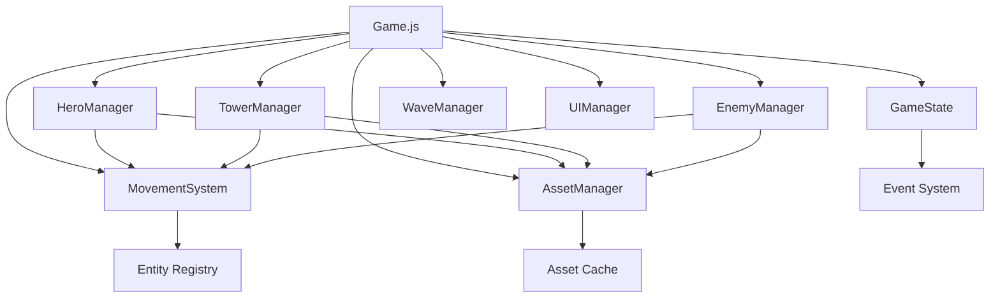

# TABSH Architecture Documentation

## Overview

TABSH follows a modular, event-driven architecture designed for maintainability, testability, and extensibility. The system is built around core principles of separation of concerns, centralized state management, and unified system coordination.

## Core Architecture Principles

### 1. Centralized State Management

All game state is managed through the `GameState` system, which provides:
- **Validation**: All state changes are validated before application
- **Events**: State changes emit events for reactive programming
- **History**: Complete audit trail of state changes
- **Persistence**: Import/export functionality for save games

```javascript
// State is managed centrally
gameState.set('gold', 500);  // Validated and event-triggered
gameState.on('goldChanged', callback);  // React to changes
```

### 2. Unified Movement System

The `MovementSystem` handles all entity movement with:
- **Priority Management**: Higher priority movements override lower ones
- **State Awareness**: Respects entity states (dead, engaged, etc.)
- **Performance**: Single update loop for all entities
- **Debugging**: Comprehensive status reporting

```javascript
// All entities use the same movement system
movementSystem.setTarget(hero, x, y, { priority: 2 });
movementSystem.setTarget(soldier, x, y, { priority: 1 });
```

### 3. Robust Asset Management

The `AssetManager` provides:
- **Fallback Assets**: Automatic placeholder generation for missing assets
- **Caching**: Efficient asset reuse
- **Batch Loading**: Parallel asset loading for performance
- **Error Tolerance**: Never crashes due to missing assets

### 4. Modular Component Design

Each game system is independent and communicates through well-defined interfaces:
- **Managers**: Handle specific game domains (heroes, towers, enemies)
- **Core Systems**: Provide foundational services (state, movement, assets)
- **Utilities**: Shared functionality across systems

## System Architecture



## Core Systems

### GameState System

The `GameState` class manages all game state through a centralized store with validation and event emission.

**Architecture:**
- **State Store**: Immutable state object
- **Validators**: Functions that validate state changes
- **Event System**: Pub/sub for state change notifications
- **History**: Audit trail of all changes

**Key Features:**
- Type validation for all state properties
- Event emission for reactive programming
- State export/import for persistence
- Atomic updates for multiple properties

```javascript
class GameState {
  constructor() {
    this.state = { /* initial state */ };
    this.listeners = new Map();
    this.validators = new Map();
    this.history = [];
  }
  
  set(key, value) {
    // Validate -> Update -> Emit -> Log
  }
}
```

### MovementSystem

Unified movement system that handles all entity movement with priority management and state awareness.

**Architecture:**
- **Entity Registry**: Map of entities to movement data
- **Priority Queue**: Higher priority movements override lower
- **State Filtering**: Respects entity states (dead, engaged)
- **Update Loop**: Single efficient update for all entities

**Movement Data Structure:**
```javascript
{
  entity: EntityReference,
  targetX: number,
  targetY: number,
  speed: number,
  priority: number,
  movementType: string,
  isMoving: boolean,
  callback: function
}
```

### AssetManager

Comprehensive asset management with fallback generation and error tolerance.

**Architecture:**
- **Asset Cache**: Map of loaded assets
- **Placeholder Generator**: Creates fallback assets
- **Load Queue**: Manages parallel loading
- **Validation**: Checks asset integrity

**Asset Loading Flow:**
1. Check cache for existing asset
2. If not cached, start loading
3. On load failure, generate placeholder
4. Cache result (asset or placeholder)
5. Return cached item

## Manager Systems

### HeroManager

Manages hero entities, their creation, movement, and combat.

**Responsibilities:**
- Hero creation and configuration
- Hero lifecycle management
- Combat coordination
- Asset loading for hero sprites

**Integration Points:**
- `MovementSystem`: For hero movement
- `AssetManager`: For hero sprites
- `GameState`: For hero-related state

### TowerManager

Manages tower placement, upgrades, and unit spawning.

**Responsibilities:**
- Tower creation and placement validation
- Tower upgrades and progression
- Unit group management (for barracks)
- Tower combat coordination

**Tower Types:**
- **Point Tower**: Single-target damage
- **Splash Tower**: Area-of-effect damage
- **Barracks Tower**: Spawns and manages units

### EnemyManager

Handles enemy spawning, movement, and combat.

**Responsibilities:**
- Enemy creation from wave data
- Path following behavior
- Combat resolution
- Death and reward handling

### WaveManager

Controls enemy wave spawning and progression.

**Responsibilities:**
- Wave timing and spawning
- Enemy group coordination
- Level progression logic
- Victory/defeat conditions

## Event System

The game uses a comprehensive event system for loose coupling between systems.

### Event Types

1. **State Events**: Emitted by GameState for state changes
2. **Game Events**: High-level game flow events
3. **Entity Events**: Entity lifecycle events
4. **UI Events**: User interface interactions

### Event Flow

```javascript
// State change triggers event
gameState.set('gold', 500);

// Event listeners react
gameState.on('goldChanged', (data) => {
  uiManager.updateGoldDisplay(data.newValue);
});

// Cross-system coordination
gameState.on('gameEnded', (data) => {
  if (data.won) {
    unlockStars(currentLevel, starsEarned);
  }
});
```

## Error Handling Strategy

### Graceful Degradation

The system is designed to continue functioning even when components fail:

1. **Asset Failures**: Fallback to generated placeholders
2. **State Validation**: Reject invalid changes, keep valid state
3. **System Errors**: Isolate failures, log errors, continue operation
4. **Network Failures**: Local fallbacks for all external dependencies

### Error Boundaries

Each system has error boundaries that prevent cascading failures:

```javascript
try {
  // System operation
} catch (error) {
  console.error('System error:', error);
  // Graceful fallback
  this.handleSystemError(error);
}
```

## Performance Considerations

### Optimization Strategies

1. **Object Pooling**: Reuse objects for frequently created/destroyed entities
2. **Efficient Rendering**: Canvas optimization techniques
3. **Batch Operations**: Group similar operations for efficiency
4. **Lazy Loading**: Load assets only when needed
5. **Event Throttling**: Limit high-frequency event emissions

### Memory Management

- **Entity Cleanup**: Proper cleanup when entities are destroyed
- **Event Listener Management**: Remove listeners to prevent memory leaks
- **Asset Disposal**: Clean up unused assets
- **State History Limits**: Bounded history to prevent memory growth

## Testing Architecture

### Multi-Layer Testing Strategy

1. **Unit Tests**: Test individual components in isolation
2. **Integration Tests**: Test system interactions
3. **End-to-End Tests**: Test complete user workflows

### Test Structure

```
tests/
├── core/           # Core system unit tests
├── integration/    # System integration tests
├── e2e/           # End-to-end tests
└── utils/         # Testing utilities
```

### Mocking Strategy

- **Dependency Injection**: Pass dependencies for easy mocking
- **Interface Contracts**: Well-defined interfaces for mocking
- **Test Doubles**: Use spies, stubs, and mocks appropriately

## Extensibility

### Adding New Systems

1. Create system class following established patterns
2. Integrate with core systems (GameState, MovementSystem, etc.)
3. Add appropriate event listeners and emitters
4. Include comprehensive tests
5. Update documentation

### Configuration-Driven Design

Most game content is driven by configuration files:

```javascript
// Level configuration
export const level1Data = {
  background: "level1.png",
  paths: [...],
  towerSpots: [...],
  waves: [...]
};
```

This allows for easy content creation and modification without code changes.

## Security Considerations

### Input Validation

- All user inputs are validated before processing
- State changes are validated through the GameState system
- Configuration files are validated on load

### Safe Asset Loading

- Assets are loaded with error handling
- Fallback assets prevent crashes from missing files
- No external script execution from assets

## Future Architecture Considerations

### Scalability

- Event system can be extended with message queues
- State system can be distributed across workers
- Asset system can integrate with CDNs

### Modularity

- Systems can be extracted to separate libraries
- Plugin architecture for game extensions
- Microservice patterns for multiplayer

### Performance

- WebGL rendering for improved graphics
- Web Workers for background processing
- IndexedDB for client-side storage